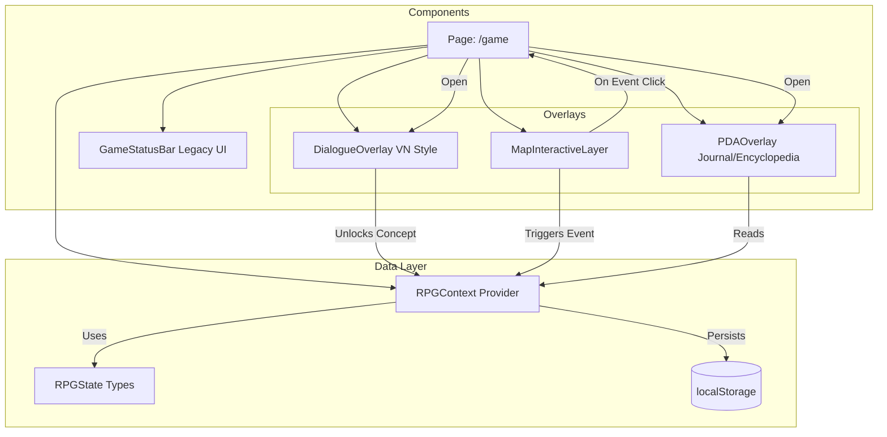

# System Architecture Map

## Overview
This document tracks the current architecture of the **PolicyGame (RPG Mode)**.

## Module Descriptions

### Data Layer
- **RPGContext**: Central store using React Context. Handles `inventory`, `journal`, `encyclopedia`, and `flags`.
- **RPGState**: TypeScript definitions for the game data models.

### UI Layers
- **MapInteractiveLayer**: An absolute positioned layer over the background map image. Renders clickable `(!)` icons based on `activeEvents`.
- **DialogueOverlay**: Visual Novel style dialogue system. Supports Left/Right/Center character portraits and multiple choice responses.
- **PDAOverlay**: The player's menu. Contains:
    - **Journal**: Clues collected during gameplay.
    - **Encyclopedia**: Educational concepts unlocked via dialogue.
